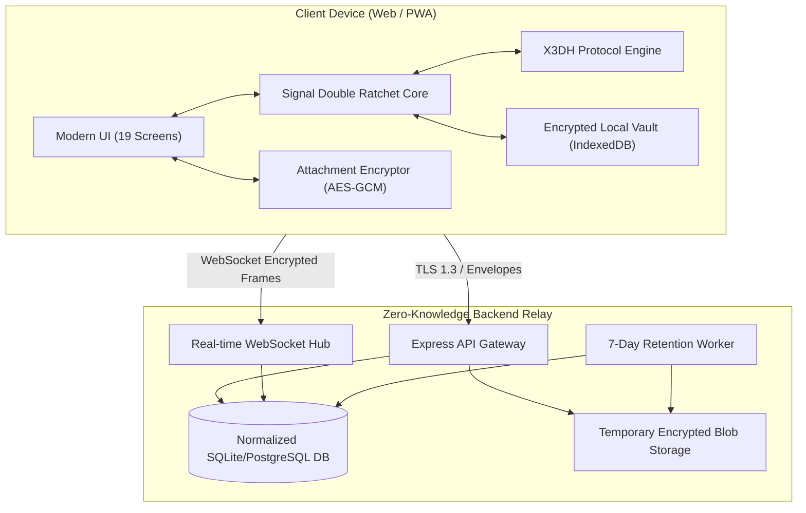

# Aegis Architecture Specification

## Overview

Aegis is a production-grade, zero-knowledge, end-to-end encrypted messaging application. Designed according to the security philosophy of Signal, Aegis guarantees that user communication, attachments, and cryptographic private keys remain strictly on client devices. The server operates as an encrypted blind relay with an automated 7-day maximum retention window.

---

## Architectural Principles

1. **Client-Side Cryptography**:
   All cryptographic operations (key pair generation, X3DH key agreement, Double Ratchet step advancement, AES-256-GCM message encryption, attachment encryption) occur strictly on the user's client using the hardware-accelerated W3C Web Cryptography API (`SubtleCrypto`).

2. **Blind Relay Model**:
   The backend server possesses:
   - Zero private keys.
   - Zero plaintext messages.
   - Zero keys capable of decrypting attachment files.
   The backend is only aware of routing metadata (sender device ID, recipient device ID, ciphertext envelope payload, expiration timestamp).

3. **7-Day Server Retention Policy**:
   Temporary ciphertext envelopes and temporary encrypted media stored on the backend are tagged with `expires_at` (strictly <= now + 7 days). The server retention janitor daemon continuously sweeps and permanently shreds all expired records and files.

4. **Normalized Multi-Device Architecture**:
   Every user may have multiple registered devices (e.g. mobile, desktop, browser). Each device possesses its own cryptographic identity key, signed pre-key, and pool of one-time pre-keys.

---

## Component Topology

---

## Data Flow: Message Transmission

1. Alice types a message for Bob.
2. Alice's client inspects local Double Ratchet session state for Bob:
   - If no session exists, Alice fetches Bob's public prekey bundle from the server, executes X3DH to derive a 32-byte shared master secret, and initializes a new Double Ratchet session.
3. Alice's client advances the symmetric sending chain, deriving a single-use message key $MK$.
4. The message payload is encrypted using AES-256-GCM with $MK$ and a 96-bit random IV.
5. Alice packages the ciphertext into an envelope (`{ recipientUserId, recipientDeviceId, encryptedEnvelope }`).
6. The envelope is transmitted via HTTPS to `/api/messages/send`.
7. The server inspects if Bob's device is currently connected to the WebSocket:
   - If connected: delivers instantly to Bob's device.
   - If offline: stores in `temporary_messages` with an expiration timestamp capped at 7 days.
8. When Bob comes online, his client downloads the envelope, processes the Double Ratchet step, derives the matching message key, decrypts the payload, and sends a delivery acknowledgment (`/api/messages/ack`).
9. Upon receipt of acknowledgment, the server permanently deletes the temporary envelope.
